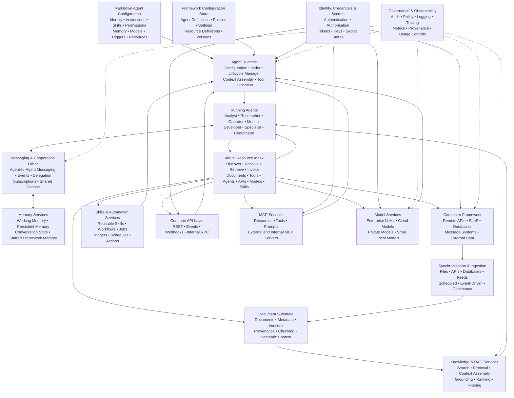

# Zero-Code Agentic Framework Architecture

## 1. Overview

The **Agentic Framework** is a common runtime and service platform for deploying autonomous and semi-autonomous AI agents without requiring agent-specific application code.

Rather than embedding document handling, retrieval, credentials, model connectivity, memory, APIs, messaging and integrations independently within every agent, these capabilities are provided once as shared framework services.

An agent is primarily defined by a **Markdown configuration document** describing its:

- identity and purpose;
- instructions and behavioural constraints;
- authorised knowledge sources;
- memory configuration;
- available tools and skills;
- automations and triggers;
- preferred models;
- API and MCP access;
- communication relationships; and
- security permissions.

The framework interprets this configuration, assembles the required services and instantiates the agent dynamically.

The architectural principle is:

> **Agents define intent and behaviour. The framework provides execution, knowledge, connectivity, memory and infrastructure.**

---

## 2. Architectural Model



---

## 3. Core Architectural Principles

### 3.1 Configuration Over Code

Agents are declaratively defined rather than programmed individually.

A Markdown document provides the human-readable agent specification while structured sections or embedded metadata provide machine-readable configuration.

For example:

```markdown
# Network Analyst Agent

## Purpose
Analyse network architecture, configuration and compliance data.

## Model
enterprise-reasoning

## Knowledge
- resource://network/cmdb
- resource://network/topology
- resource://standards/network

## Skills
- topology-analysis
- compliance-check
- diagram-generation

## Memory
persistent: true
shared_namespace: network-architecture

## Permissions
- read:network-data
- invoke:network-tools
- message:architecture-agents
```

The runtime resolves these declarations into concrete framework services when the agent starts.

---

## 4. Agent Runtime

The **Agent Runtime** is responsible for transforming a configuration definition into an operational agent.

Its responsibilities include:

- parsing agent Markdown;
- validating configuration;
- resolving resources;
- assigning models;
- attaching skills and tools;
- establishing memory;
- obtaining credentials;
- registering messaging endpoints;
- creating RAG contexts;
- applying permissions and policies;
- managing execution state; and
- starting and stopping agents.

The runtime therefore acts as the boundary between a declarative agent specification and the underlying infrastructure.

---

## 5. Document Substrate

The document substrate provides a canonical information layer shared across agents.

It can contain:

- text documents;
- Markdown;
- PDFs;
- structured JSON;
- API responses;
- database records;
- source code;
- configuration files;
- generated reports;
- conversations; and
- synthetic agent-produced knowledge.

Documents can carry associated:

- provenance;
- ownership;
- timestamps;
- classification;
- version history;
- access controls;
- source references;
- embeddings;
- relationships; and
- semantic metadata.

The substrate should preserve both original source material and derived representations.

---

## 6. Synchronisation and Data Ingestion

Synchronisation services continuously populate and maintain the document substrate.

Sources may include:

- remote APIs;
- enterprise systems;
- databases;
- file repositories;
- SaaS platforms;
- message queues;
- web feeds;
- source-control platforms;
- event streams; and
- other agentic environments.

Synchronisation may operate through:

1. **Scheduled imports** — periodic polling or batch ingestion.
2. **Event-driven updates** — triggered by webhooks or messages.
3. **Continuous synchronisation** — incremental or streaming updates.
4. **On-demand retrieval** — acquisition initiated by an agent.

Where possible, synchronisation records deltas rather than repeatedly importing complete datasets.

---

## 7. Virtual Resource Index

A central architectural capability is a **Virtual Resource Index**.

This provides agents with a stable logical namespace for discovering resources without requiring knowledge of their underlying implementation or physical location.

Examples might include:

```text
resource://finance/revenue/current
resource://network/topology/global
resource://skills/document-analysis
resource://agents/security-architect
resource://models/local/classifier
resource://api/customer-profile
resource://automation/daily-report
```

A resource identifier may resolve to:

- a document;
- collection;
- database query;
- external API;
- MCP resource;
- skill;
- workflow;
- automation;
- model;
- tool;
- service; or
- another agent.

The index creates an abstraction between **what an agent requires** and **where or how that capability is implemented**.

Implementations can therefore change without requiring modification of every dependent agent.

---

## 8. Skills and Automations

Skills provide reusable units of agent capability.

Examples include:

- document analysis;
- classification;
- data transformation;
- reporting;
- API interaction;
- diagram generation;
- compliance analysis;
- software development;
- notification;
- scheduling; and
- workflow orchestration.

Automations extend these capabilities through:

- schedules;
- events;
- conditions;
- data changes;
- incoming messages; and
- external triggers.

An agent can therefore inherit sophisticated functionality simply by declaring a skill or automation within its configuration.

---

## 9. Memory Architecture

The framework provides memory as an infrastructure service rather than requiring each agent to implement its own memory system.

Memory may be divided into:

### Working Memory

Temporary context associated with an active task or conversation.

### Persistent Agent Memory

Longer-lived information belonging to a particular agent.

### Shared Framework Memory

Information available to authorised groups of agents.

### Episodic Memory

Historical records of previous activities, decisions and interactions.

### Semantic Memory

Structured knowledge accumulated through operation.

Shared memory also provides one of the primary mechanisms through which cooperating agents can maintain a common operating context.

---

## 10. Agent Messaging and Cooperation

All agents participate in a common messaging fabric.

The messaging layer can support:

- direct agent-to-agent communication;
- request and response;
- task delegation;
- asynchronous events;
- publish/subscribe;
- broadcast messages;
- workflow coordination;
- notifications; and
- collaborative problem solving.

For example:

```text
Research Agent
      |
      | research.complete
      v
Analysis Agent
      |
      | analysis.complete
      v
Report Agent
      |
      | report.ready
      v
Review Agent
```

Because messaging and memory are shared framework capabilities, agents do not require bespoke integration code to cooperate.

---

## 11. RAG and Knowledge Services

Retrieval-Augmented Generation is provided centrally.

The RAG layer can perform:

1. resource resolution;
2. permission filtering;
3. query interpretation;
4. document retrieval;
5. ranking;
6. contextual filtering;
7. chunk selection;
8. provenance preservation;
9. context assembly; and
10. delivery to the selected model.

Agents therefore consume knowledge through a consistent retrieval interface regardless of where the underlying information resides.

---

## 12. Common API and MCP Services

The framework exposes common capabilities through standard interfaces.

### API Services

Common APIs may expose:

- agents;
- documents;
- memory;
- search;
- resources;
- skills;
- messaging;
- workflows;
- models; and
- administrative functions.

### MCP Services

Model Context Protocol services provide a standard mechanism for exposing:

- resources;
- tools;
- prompts; and
- agent-accessible capabilities.

The framework can operate simultaneously as:

- an MCP client;
- an MCP server;
- an MCP gateway; and
- an MCP resource registry.

This allows internal and external agent ecosystems to interoperate through a common protocol.

---

## 13. Model Management

Model connectivity is abstracted behind a common model service.

The framework can manage connections to:

- enterprise LLM services;
- private hosted models;
- public cloud models;
- specialist models;
- reasoning models;
- embedding models; and
- small local models.

Small local models may handle lightweight operations such as:

- intent recognition;
- classification;
- routing;
- entity extraction;
- formatting;
- filtering;
- validation; and
- simple transformation.

More expensive remote models can then be reserved for tasks requiring deeper reasoning.

Agents request model capabilities rather than embedding provider-specific implementation details.

For example:

```yaml
model:
  capability: reasoning
  privacy: enterprise
  minimum_context: 128k
```

The framework can dynamically resolve the most appropriate available model.

---

## 14. Credential and Identity Management

Credentials are never embedded directly in an agent definition.

Agents instead request access to logical resources.

The framework handles:

- identity;
- authentication;
- authorisation;
- API keys;
- OAuth tokens;
- certificates;
- service accounts;
- secret rotation;
- credential expiry; and
- delegated access.

For example:

```text
Agent
  |
  | Request resource://crm/customers
  v
Resource Resolver
  |
  | Check agent identity + policy
  v
Credential Service
  |
  | Obtain authorised token
  v
CRM Connector
```

This keeps secrets outside agent prompts and configuration while permitting centrally governed access.

---

## 15. Agent Configuration Store

Agent definitions are stored and versioned centrally.

The configuration store may maintain:

- agent Markdown;
- system instructions;
- model policies;
- tool assignments;
- permissions;
- memory policies;
- environment settings;
- resource mappings;
- dependencies; and
- version history.

An agent can therefore be promoted through environments in much the same way as software configuration:

```text
Development
    ↓
Testing
    ↓
Certification
    ↓
Production
```

The deployable artefact is primarily configuration rather than conventional application code.

---

## 16. Governance and Observability

Because infrastructure is centralised, governance can also be centralised.

The framework can provide:

- execution logs;
- model usage records;
- tool invocation histories;
- data provenance;
- security events;
- agent conversations;
- resource access records;
- cost metrics;
- policy decisions;
- performance telemetry; and
- distributed traces.

This creates an auditable record of:

> **Which agent performed what action, using which information, through which capability, under whose authority, and with what result.**

---

## 17. Agent Lifecycle

A typical agent lifecycle is:

```text
Markdown Definition
        ↓
Configuration Validation
        ↓
Identity & Permission Assignment
        ↓
Resource Resolution
        ↓
Memory Attachment
        ↓
Skill / Tool Attachment
        ↓
Model Assignment
        ↓
Messaging Registration
        ↓
Agent Activation
        ↓
Observe → Reason → Retrieve → Cooperate → Act
```

When the configuration changes, the agent can be reloaded or re-instantiated without rewriting application software.

---

## 18. Architectural Outcome

The framework effectively transforms agents from standalone applications into **lightweight logical entities operating on a common cognitive infrastructure**.

Traditional software architecture tends to produce:

```text
Application
 ├── Database
 ├── Authentication
 ├── APIs
 ├── Integrations
 ├── Search
 ├── Business Logic
 └── User Interface
```

The agentic model instead becomes:

```text
Agent
 └── Markdown Configuration
       ↓
Shared Agentic Framework
       ├── Knowledge
       ├── Memory
       ├── Models
       ├── Skills
       ├── Tools
       ├── Messaging
       ├── APIs
       ├── MCP
       ├── Credentials
       ├── Connectors
       └── Automations
```

The result is a system in which creating a new agent is closer to **describing a capable worker** than developing a new software application.

A new agent can potentially be introduced by creating a single Markdown document, assigning appropriate resources and permissions, and allowing the framework to provide everything required for it to operate.

---

## 19. Summary

The architecture establishes a reusable **agent operating environment** consisting of four fundamental abstractions:

**Agents** define purpose and behaviour.

**Resources** represent everything agents can know, use or invoke.

**Framework services** provide memory, models, retrieval, messaging, identity, integration and execution.

**Configuration** binds these elements together declaratively.

This separation allows large numbers of specialised agents to be created, modified, composed and retired with very little engineering effort while retaining consistent governance, security, observability and interoperability across the entire agent ecosystem.
